# ONE PIECE Quizzes!

Test your knowledge of the great pirate world in  these ONE PIECE Quizzes! There are different challenging categories you can try out now! Guess characters from their silhouette. Do you know the name of the islands? Recognize who said iconic phrases from the show. And lastly, guess the japanese name of random devil fruits!

### [Live site](https://biagiarelliadriano.github.io/One-Piece-Quiz/)
### [Repository](https://github.com/BiagiarelliAdriano/One-Piece-Quiz)

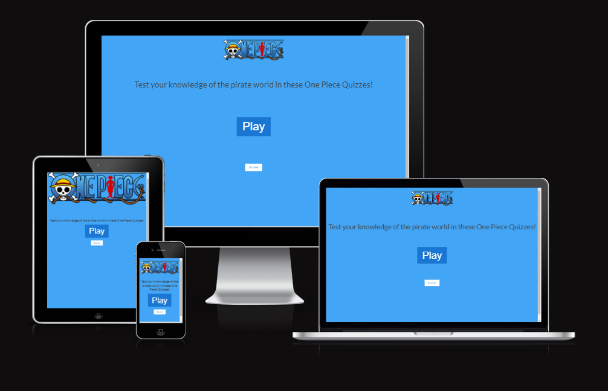

# Wireframes
## Desktop Wireframe
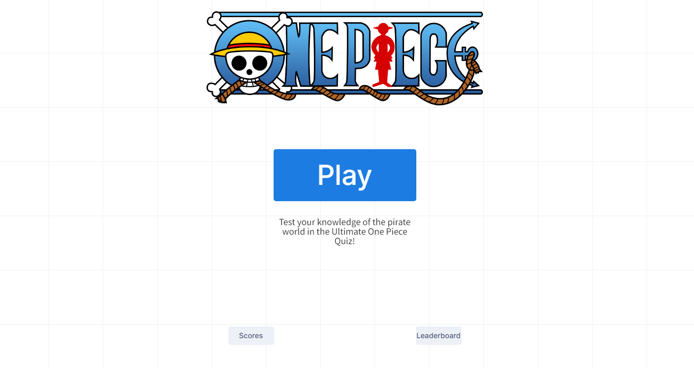
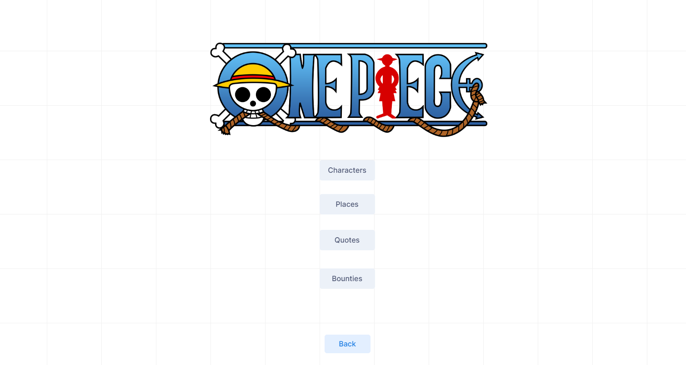
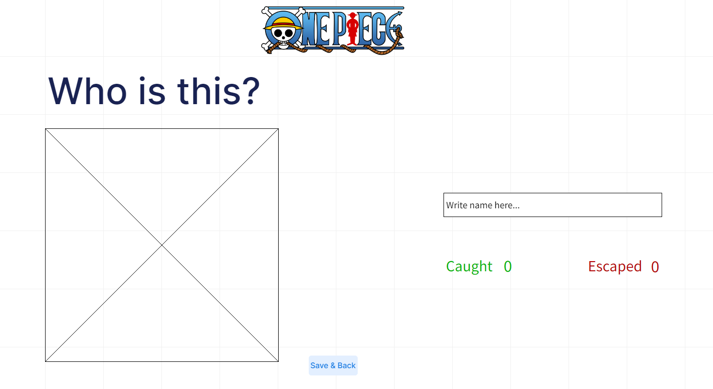
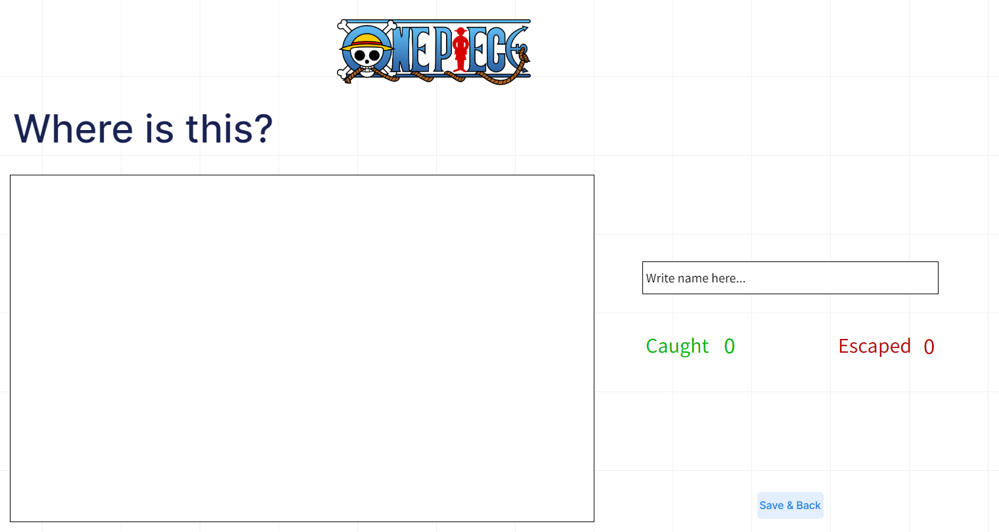
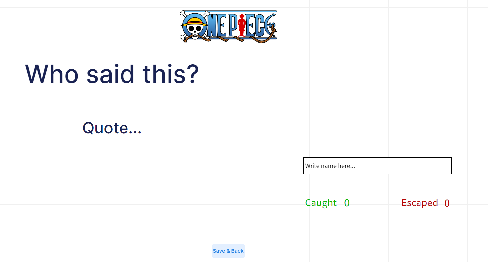

# Features
## Home Page
Very simple and intuitive overall design throughout the page. Easy to understand features, starting with the home page, with just an introductory phrase, a Play button, which will take the user to the next section of the page and a Scores button, where the user will be able to view their current scores result from them playing!
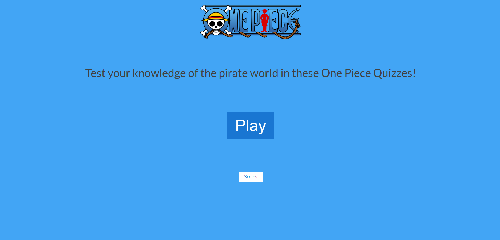

## Quiz Selection
Here the users will be able to choose from an array of different quiz categories to test out their knowledge! Characters, places, quotes and devil fruits! All based on canon elements present in the manga and the anime show.
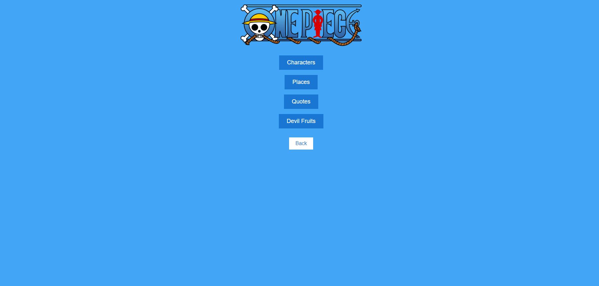

## Characters Quiz
A random silhouette representing a character will appear. The user will have to input their answer in the already focused input field. When they input their answer, if it was correct they will get a point and the image will be colored! If they get it incorrect, they will get an incorrect point and the text will change, telling the user what the correct answer was! All of the quizzes have many random options that can show up. No option can show twice in a row, but options will repeat themselves, making the game virtually infinite, until the user decides it's enough! The user can then click the Save & Back button to save their current score for the Scores Table in the home page and return to the Quiz Selection section to continue on playing!
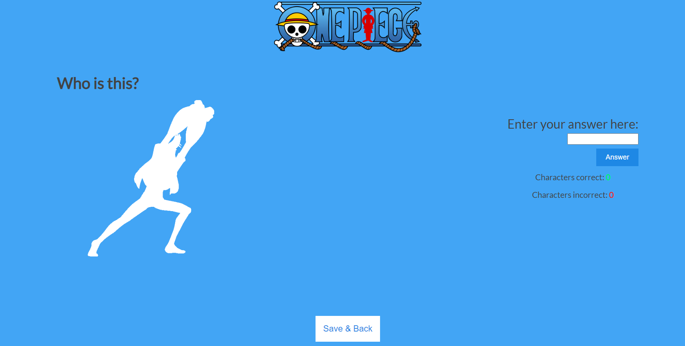

## Places Quiz
All of the quizzes have the base functionalities of keeping scores and showing correct answers when the user gives an incorrect answer. In this quiz the user will be presented with a random island or location of the amazing One Piece world and they will have to input the correct name!
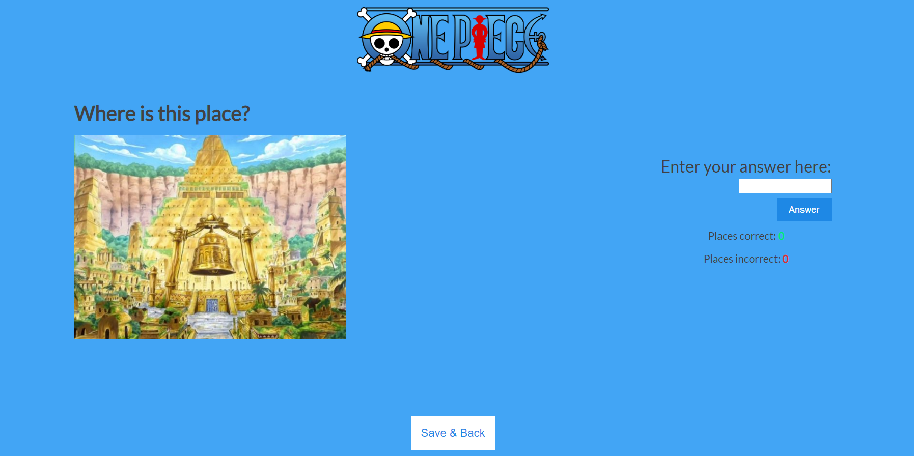

## Quotes Quiz
In this very simple designed quiz the user will be presented with an iconic quote from the One Piece media and they will have to correctly guess who said it!
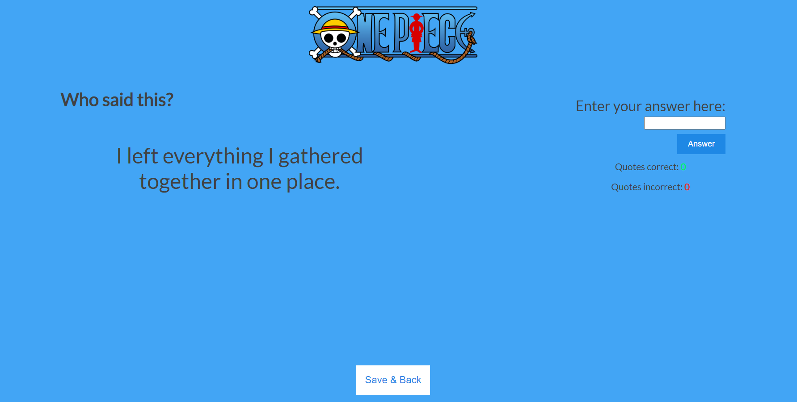

## Devil Fruits Quiz
And here we are, to the last and more challenging quiz! The user will have to guess the correct japanese name for the devil fruit shown. Only hardcore fans of the series will be able to get correct answers! All the images are canon representations of what the devil fruits looked like.
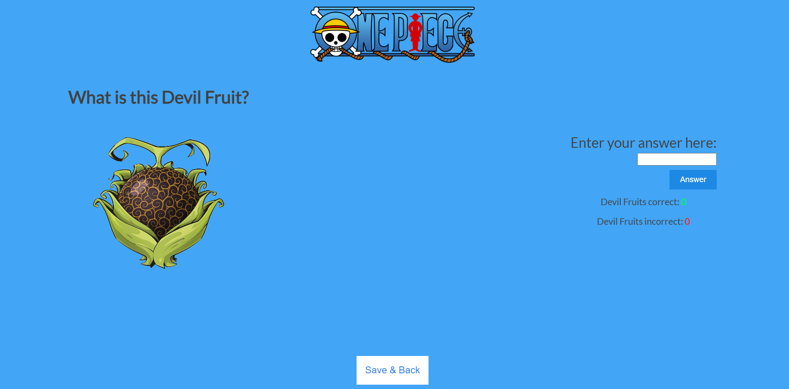

## Features left to be implemented
-	I would have liked to put an actual image for the background, but I couldn't find the way to make it look good with all the other elements of the page.
-	I would like to put a relaxing background music from the show to play while the user is in the website.
-	Like all quizzes, what makes them good is the diversity of the questions. With more time and resources I would have put way more options for all the different quizzes, reflecting the proportions of the world of One Piece!
-	Following some user feedback given to me, in the future I would also add a way to let the user decide to either save their current score or to reset it, letting them start from blank without them needing to reload the page.

# Testing
- I confirmed that the game results are always correct.
- I confirmed that instructions, options and results text are all readable and easy to understand.
- I confirmed that the colors and fonts chosen are easy to understand and accessibly by running it through lighthouse in devtools.
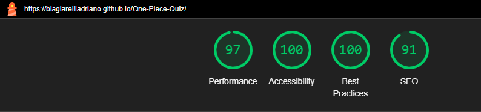
-	I confirmed that this project is responsive, looks good and functions on all standard screen sizes using the devtools device toolbar.

## Validator Testing
- HTML
	- Two errors were found during the official W3C validator testing. Fixed it by implementing a placeholder image inside the src attributes.
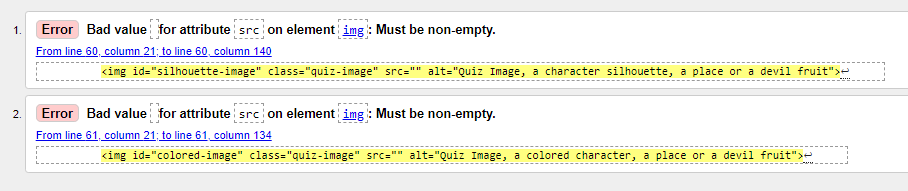
	- No other errors were returned after these.
- CSS
	- No errors were found when passing through the official (Jigsaw) validator.
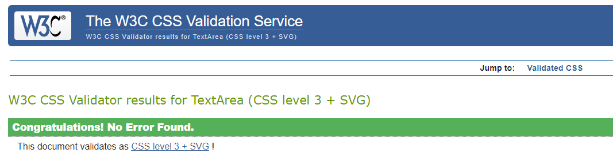
- Javascript
	- No relevant errors were found when passing throught the official JSHint validator.
 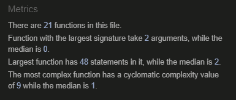

## Unfixed Bugs
No unfixed bugs.

## Deployment
To deploy the project I followed these steps starting from the main project repository [here](https://github.com/BiagiarelliAdriano/One-Piece-Quiz).

 1. Clicked on `Settings` on the navigation menu in the repository.
 2. I then selected the `Pages` menu on the side bar.
 3. In the first dropdown menu labeled `Source` I selected the branch of the name `main` from the dropdown.
 4. In the next dropdown labeled `/root` I left as the default option.
 5. Selected Save.

# Credits
## Content
- Chatgpt was used for general advice and errors fixing.
- TinyPNG was used to compress the images for better page performance.
- MockFlow was used to make the wireframes.
- ImgBB was used to implement images inside the Readme.md.
- Font Awesome was used to the favicons.
- Validator W3 was used to test the HTML code.
- Jigsaw W3 validator was used to test the CSS code.
- JSHint was used to test the Javascript code.
- StackEdit was used to write this Readme.md.
- Krita was used by me to edit the images for the quizzes.

## Media
- All the images are from [Pinterest](https://www.pinterest.de/).
